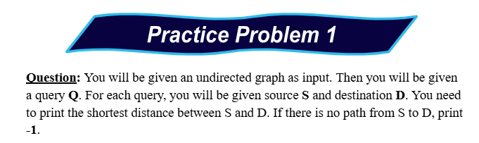
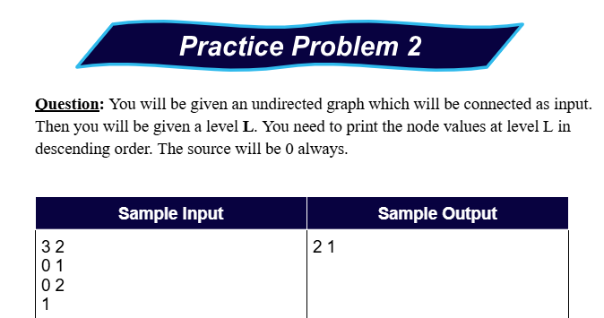
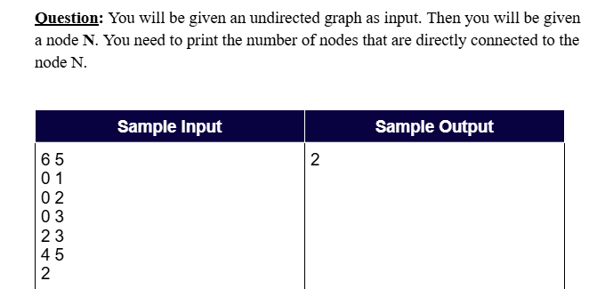

# Practice-day-about-BFS
https://leetcode.com/problems/keys-and-rooms/description/

Approach for "841. Keys and Rooms" Problem

Problem Understanding

We are given a list of N rooms, where each room contains keys to other rooms. We start in room 0 and need to determine if we can visit all rooms.

✔ Graph Representation:

Each room represents a node in a graph.

The keys in each room represent edges leading to other rooms.

✔ Graph Traversal:

We use Breadth-First Search (BFS) to explore all reachable rooms.

A visited array keeps track of rooms that have been opened.

If all rooms are visited after BFS, return true; otherwise, return false.

Algorithm

Initialize BFS:

Start from room 0.

Mark it as visited and push it into a queue.

Process BFS:

While the queue is not empty:

Extract the front room.

Visit all rooms that have keys in this room (if not already visited).

Check Connectivity:

After BFS, if any room remains unvisited, return false.

Otherwise, return true (all rooms are accessible).

Time & Space Complexity Analysis

BFS Traversal: O(N + E) (N = rooms, E = total keys)

Checking Visited Array: O(N)

Overall Time Complexity: O(N + E)

Space Complexity: O(N) (for vis[] and queue storage)

Key Takeaways

✔ BFS efficiently explores all rooms that can be visited.

✔ If any room remains unvisited after traversal, return false.

✔ Using an adjacency list representation makes traversal efficient.

https://cses.fi/problemset/task/1667

Approach for "Message Route" Problem

Problem Understanding

We are given an undirected graph with n nodes and e edges. The task is to find the shortest path from node 1 to node n using Breadth-First Search (BFS). If no path exists, print "IMPOSSIBLE".

Algorithm

Graph Representation

Use an adjacency list to store edges.

Read input and construct the graph.

Breadth-First Search (BFS)

Start BFS from node 1.

Use a queue to explore nodes level by level.

Track visited nodes with a visited array (vis[]).

Store shortest distances using the level[] array.

Maintain a parent[] array to trace the shortest path.

Path Construction

If node n is not visited, print "IMPOSSIBLE".

Otherwise, backtrack using the parent[] array to reconstruct the path.

Print the length of the path and the nodes in order.

Time & Space Complexity Analysis

Graph Construction: O(E) (Each edge is stored once)

BFS Traversal: O(V + E)

Path Construction: O(V) (Backtracking the parent array)

Overall Time Complexity: O(V + E)

Space Complexity: O(V + E) (Adjacency list + auxiliary arrays)

Key Takeaways

✔ BFS ensures the shortest path in an unweighted graph.

✔ Parent tracking helps reconstruct the path efficiently.

✔ Using an adjacency list improves space efficiency for sparse graphs.

Approach for the BFS Distance Query Problem
Problem Understanding
We are given an undirected graph with n nodes and e edges. After constructing the graph, we process q queries where each query consists of:

A source node src.
A destination node disti.
Find the shortest distance from src to disti using Breadth-First Search (BFS).
Algorithm
Graph Representation

Use an adjacency list to store the graph.
Read input and construct the graph with adj_list[a].push_back(b).
Processing Queries

For each query, read src and disti.
Reset the vis[] (visited array) and level[] (distance array).
Run BFS from src to compute shortest distances.
Print level[disti], which gives the shortest path from src to disti.
Time & Space Complexity Analysis
Graph Construction: O(E)
BFS Traversal: O(V + E) per query
Resetting Arrays: O(V) per query
Total Complexity: O(q * (V + E))
Space Complexity: O(V + E) (Adjacency list + BFS arrays)
Key Takeaways
✔ BFS is optimal for finding the shortest path in an unweighted graph.
✔ The graph is traversed separately for each query, making it straightforward.
✔ Resetting vis[] and level[] before each BFS ensures correct results.

Approach for Finding Nodes at a Given Level Using BFS
Problem Understanding
We are given an undirected graph with n nodes and e edges. The task is to:

Perform BFS traversal from node 0.
Find all nodes that are exactly at level l.
Sort them in descending order and print them.
Algorithm
Graph Representation

Use an adjacency list to store the graph.
Read input and construct the graph with adj_list[a].push_back(b).
BFS Traversal

Initialize vis[] (visited array) and level[] (distance array).
Perform BFS from node 0, updating level[node].
Finding Nodes at Level l

Traverse all nodes. If level[i] == l, store it in a result array.
Sort the result array in descending order.
Output the Nodes

Time & Space Complexity Analysis
Graph Construction: O(E)
BFS Traversal: O(V + E)
Finding Nodes: O(V)
Sorting the Result: O(V log V) (worst case, if all nodes are at the same level)
Total Complexity: O(V log V + E)
Space Complexity: O(V + E) (Adjacency list + BFS arrays)
Key Takeaways
✔ BFS efficiently calculates shortest distances from the source.
✔ Finding nodes at a specific level is straightforward using BFS.
✔ Sorting ensures the result is printed in descending order.

Approach for Finding the Degree of a Node in an Undirected Graph
Problem Understanding
We are given an undirected graph with n nodes and e edges. The task is to:

Construct the graph using an adjacency list.
Take a source node src as input.
Print the degree of src, i.e., the number of edges connected to it.
Algorithm
Graph Representation

Use an adjacency list (adj_list[]) to store the graph.
Read input edges and add them in both directions (a → b and b → a).
Finding the Degree of src

The degree of a node is simply the size of its adjacency list (adj_list[src].size()).
Output the Degree

Time & Space Complexity Analysis
Graph Construction: O(E)
Finding the Degree: O(1)
Total Complexity: O(E)
Space Complexity: O(V + E) (Adjacency list storage)
Key Takeaways
✔ An adjacency list efficiently stores graph connections.
✔ The degree of a node is simply the size of its adjacency list.
✔ Efficient implementation with O(1) lookup for degree calculation.

